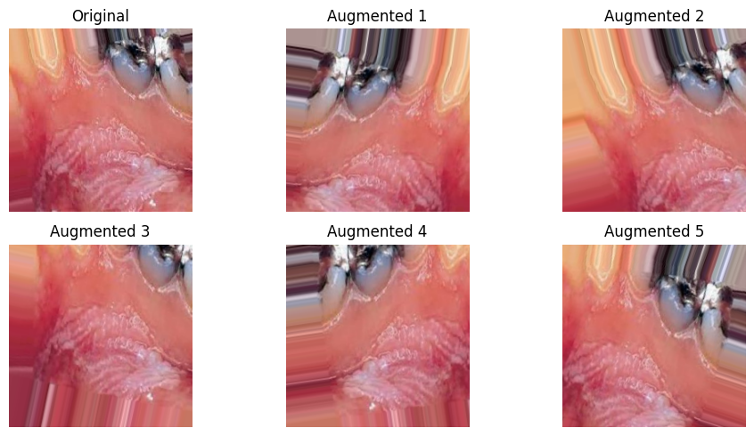

# 🦷 Teeth Classification using CNN

This project implements a **Convolutional Neural Network (CNN)** for **teeth classification**, trained on a dataset of dental images. The model is built using **TensorFlow** and includes **data preprocessing, augmentation, training, evaluation, and prediction**.

---

## 📌 Project Overview

✅ **Preprocessing & Augmentation**: Images are normalized and augmented to improve model performance.  
✅ **CNN Model**: A deep convolutional neural network with **batch normalization & dropout** for better generalization.  
✅ **Training & Evaluation**: Trained for **30 epochs**, with validation and performance tracking.  
✅ **Prediction**: Allows classification of new images using the trained model.  
✅ **Visualization**: Displays **original & augmented images** for better understanding.  

---

## 🚀 Installation

### **1. Clone the Repository**
```sh
git clone https://github.com/your-repo/teeth-classification.git
cd teeth-classification
pip install tensorflow numpy matplotlib
```

### **2. Prepare the Dataset**
Ensure you have the dataset in the following structure:
```
Teeth_Dataset/
    Training/
        Class1/
        Class2/
        ...
    Validation/
        Class1/
        Class2/
        ...
    Testing/
        Class1/
        Class2/
        ...
```

---

## 📊 Usage

### **1. Training the Model**
Run the `model.ipynb` notebook to preprocess the data, build the model, and train it.

### **2. Evaluating the Model**
After training, the model's performance on the validation set will be displayed.

### **3. Making Predictions**
Use the trained model to classify new images. Example code is provided in the `model.ipynb` notebook.

### **4. Visualizing Images Before and After Augmentation**


---

## 📈 Results
The model achieves a validation accuracy of approximately 85% after 30 epochs of training.

---
